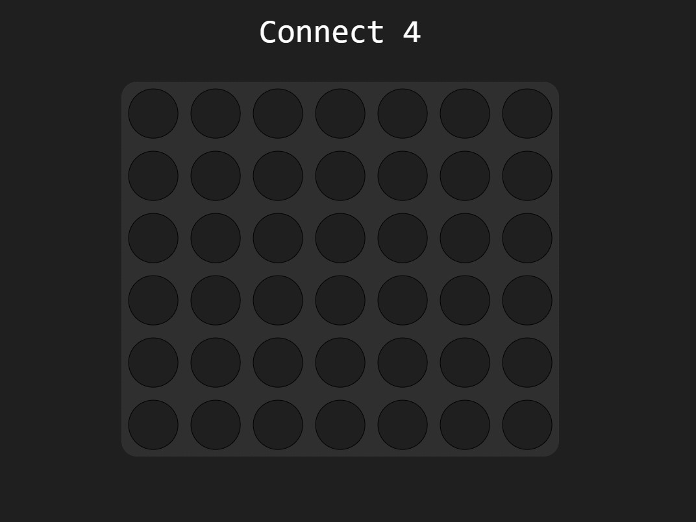
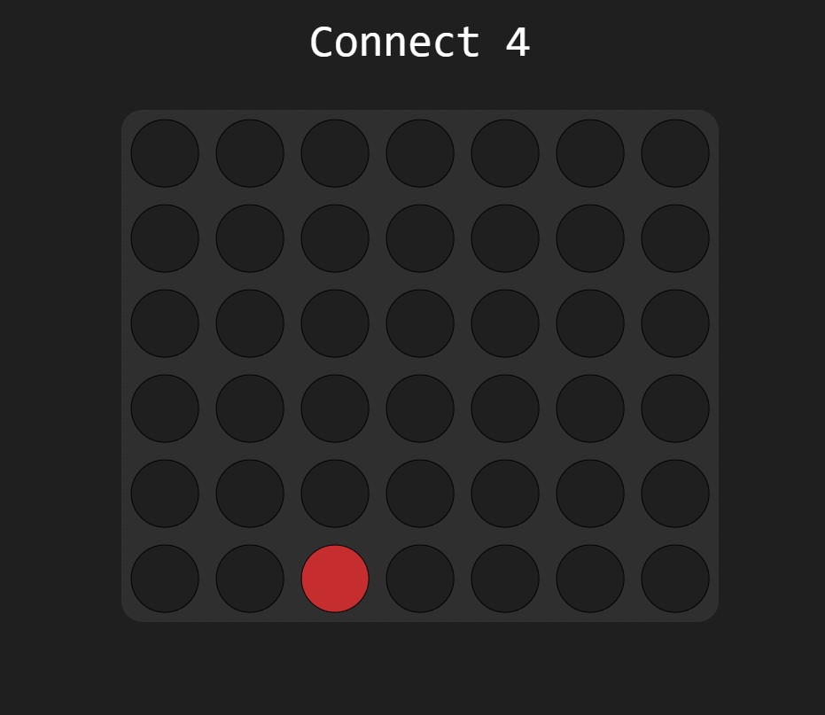
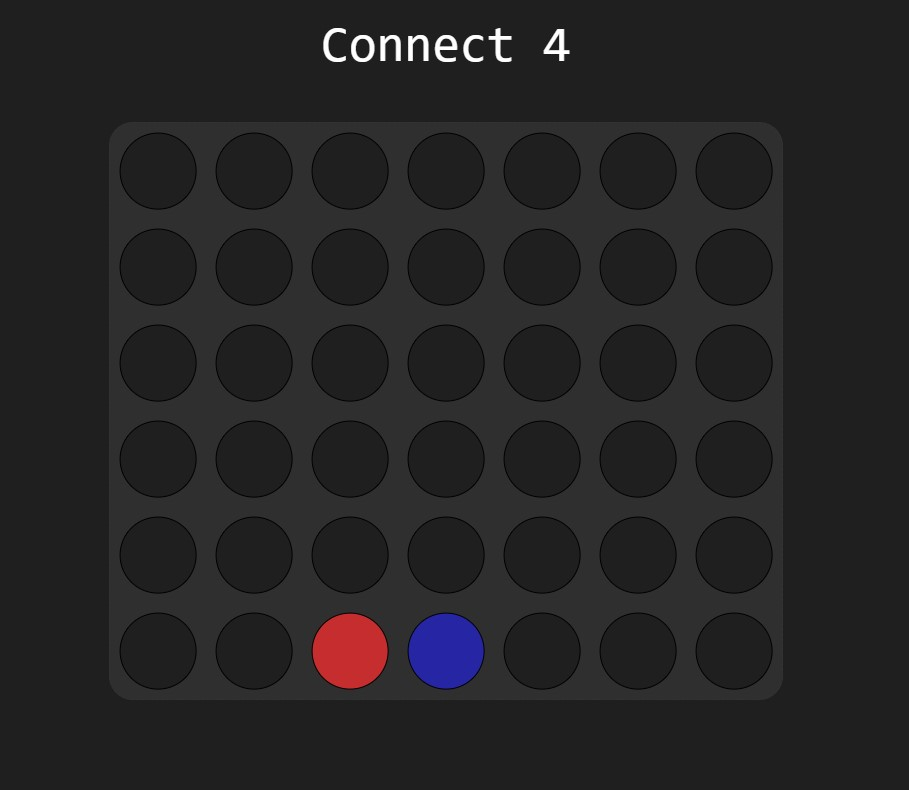
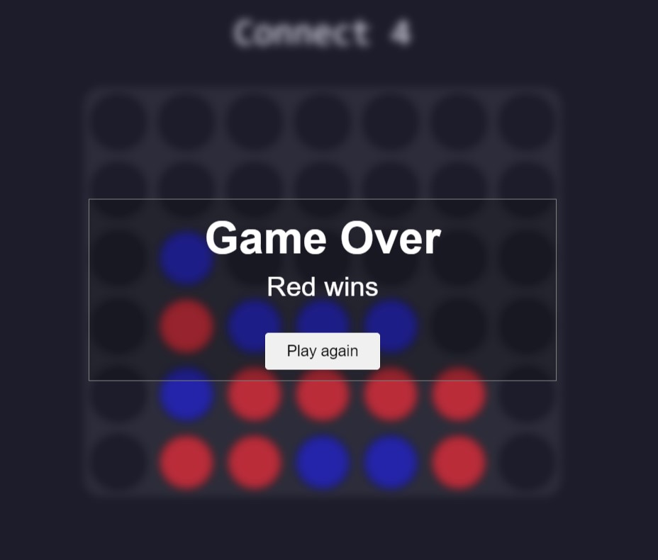

# connect-4 

Welcome to connect-4, a classic strategy game where two players compete to connect four of their colored discs in a row, column, or diagonal. This repository contains the code for a digital implementation of the Connect 4 game.

## Game Rules and Description

Connect 4 is played on a 6x7 grid. Players take turns dropping their colored discs from the top of any column. The disc will then occupy the lowest available spot in that column. The game continues until a player successfully connects four discs either horizontally, vertically, or diagonally. The first player to achieve this wins the game. The game can start over if desired.


## Gameplay Screenshots

1. Initial board setup


2. Player 1's turn - red disc dropped in column 3


3. Player 2's turn - blue disc dropped in column 4
 

4. Player 1 wins by aligning consecutive 4 red disc horizontally
 


## Development

### Setup

1. **Clone the Repository:**

   Clone the repository into a local directory using Git.

   ```bash
   git clone https://github.com/omkarbhale/connect-4

2. **Navigate to Project Folder:**
   
    Go to the project folder.

   ```bash
   cd connect4

2. **Open with Live Server:**
   
   If you have the Live Server extension in Visual Studio Code or a similar tool:
   
   - Open the project in Visual Studio Code.
   - Right-click on `index.html`.
   - Select "Open with Live Server".
   - Play the Game in Your Browser.
